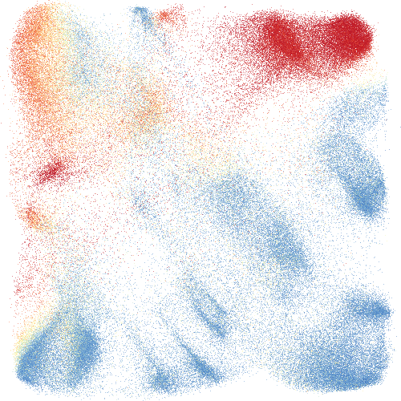

# GigaSOM.jl <br> Huge-scale, high-performance flow cytometry clustering

GigaSOM is a Julia toolkit for clustering and visualisation of really large cytometry data. Most generally, it can load FCS files, perform transformation and cleaning operations in their contents, run FlowSOM-style clustering, and visualize and export the results. GigaSOM is distributed and parallel in nature, which makes processing huge datasets a breeze -- a hundred of millions of cells with a few dozen parameters can be clustered and visualized in a few minutes.

| **Documentation** | **Test Coverage** | **[ARTENOLIS](http://opencobra.github.io/artenolis)** |
|:-----------------:|:------------:|:--------------------------:|
| [](http://git.io/GigaSOM.jl) | [](http://codecov.io/github/LCSB-BioCore/GigaSOM.jl?branch=master) | [](https://prince.lcsb.uni.lu/jenkins/job/GigaSOM.jl-branches-auto-linux/) |

# How to get started

## Prerequisites and requirements

- **Operating system**: Use Linux (Debian, Ubuntu or centOS), MacOS, or Windows 10 as your operating system. GigaSOM has been tested on these systems.
- **Julia language**: In order to use GigaSOM, you need to install Julia 1.0 or higher. You can find the download and installation instructions for Julia [here](https://julialang.org/downloads/).
- **Hardware requirements**: GigaSOM runs on any hardware that can run Julia, and can easily use resources from multiple computers interconnected by network. For processing large datasets, you require to ensure that the total amount of available RAM on all involved computers is larger than the data size.

:bulb: If you are new to Julia, it is adviseable to [familiarize youself with
the environment
first](https://docs.julialang.org/en/v1/manual/getting-started/).  Use the full
Julia [documentation](https://docs.julialang.org) to solve various possible
language-related problems, and the [Julia package manager
docs](https://julialang.github.io/Pkg.jl/v1/getting-started/) to solve
installation-related difficulties.

## Installation

Using the Julia package manager to install GigaSOM is easy -- after starting Julia, type:

```julia
import Pkg; Pkg.add("GigaSOM");
```

Then you can load the GigaSOM package and start using it:

```julia
using GigaSOM
```

The first loading of the GigaSOM package may take several minutes to complete due to precompilation of the sources, especially on a fresh Julia install.

### Test the installation

If you run a non-standard platform (e.g. a customized operating systems), or if you added any modifications to GigaSOM source code, you may want to run the test suite to ensure that everything works as expected:

```julia
import Pkg; Pkg.test("GigaSOM");
```

For debugging, it is sometimes very useful to enable the `@debug` messages from the source, as such:
```julia
using Logging
global_logger(ConsoleLogger(stderr, Logging.Debug))
```

## How to use GigaSOM

A comprehensive documentation is [available online](https://lcsb-biocore.github.io/GigaSOM.jl/); several [introductory tutorials](https://lcsb-biocore.github.io/GigaSOM.jl/latest/tutorials/basicUsage/) of increasing complexity are also included.

A very basic dataset (Levine13 from [FR-FCM-ZZPH](https://flowrepository.org/id/FR-FCM-ZZPH)) can be loaded, clustered and visualized as such:

```julia
using GigaSOM

params, fcsmatrix = loadFCS("Levine_13dim.fcs")  # load the FCS file

exprs = fcsmatrix[:,1:13]  # extract only the data columns with expression values

som = initGigaSOM(exprs, 20, 20)    # random initialization of the SOM codebook
som = trainGigaSOM(som, exprs)      # SOM training
clusters = mapToGigaSOM(som, exprs) # extraction of per-cell cluster IDs
e = embedGigaSOM(som, exprs)        # EmbedSOM projection to 2D
```

The example loads the data, runs the SOM training (as in FlowSOM) and computes a 2D projection of the dataset (using EmbedSOM); the total computation time (excluding the possible precompiltion of the libraries) should be around 15 seconds.

The results can be visualized e.g. with [GigaScatter](https://github.com/LCSB-BioCore/GigaScatter.jl#usage-with-gigasomjl) which we developed for this purpose, or by exporting the data and plotting them with any other programming language. For example, to save an embedding with highlighted expression of CD4, you can install and use GigaScatter as such:

```julia
import Pkg; Pkg.add("GigaScatter")
using GigaScatter

savePNG("Levine13-CD4.png",
  solidBackground(rasterize((500,500),        # bitmap size
    Matrix{Float64}(e'),                      # the embedding coordinates
    expressionColors(
      scaleNorm(Array{Float64}(exprs[:,5])),  # 5th column contains CD4 expressions
      expressionPalette(100, alpha=0.5)))))   # colors for plotting (based on RdYlBu)
```

The output may look like this (blue is negative expresison, red is positive):




## Feedback, issues, questions

Please use the GitHub issue tracker at https://github.com/LCSB-BioCore/GigaSOM.jl/issues to report any problems with the software, and discuss any potential questions about GigaSOM use.

If reporting issues, please do not forget to include a description of conditions under which the issue occurs; preferably a code snippet that can be run separately (sometimes termed "minimal crashing example").

