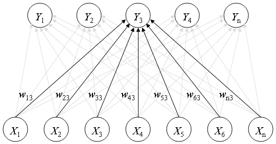
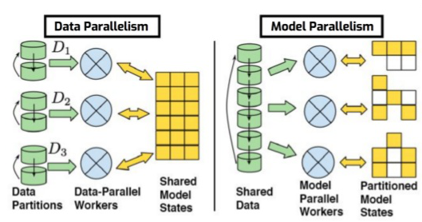

# Background

## Introduction

Flow cytometry clustering for several hundred million cells has long been hampered
by software limitations. Julia allows us to go beyond these limits.
Through the high-performance GigaSOM.jl package, we gear up for huge-scale
flow cytometry analysis, softening these limitations with an innovative approach
on the existing algorithm, by implementing parallel computing with stable and
robust mathematical models that would run with an HPC cluster, allowing us to
run cytometry datasets as big as 500 million cells.

## Flow Cytometry

Immunology is a very important branch of the medical and biological sciences and
its research has provided critically important research techniques and tools, such as flow cytometry.
The use of flow cytometry has grown substantially in the past decade, mainly due to
the development of smaller, user-friendly and less expensive instruments,
but also to the increase of clinical applications, like cell counting, cell sorting,
detection of biomarkers or protein engineering.
Flow cytometry is an immunophenotyping technique used to identify and quantify the
cells of the immune system by analysing their physical and chemical characteristics
in a fluid. These cells are stained with specific, fluorescently labelled antibodies
and then analysed with a flow cytometer, where the fluorescence intensity is measured
using lasers and photodetectors. [[3]](http://clinchem.aaccjnls.org/content/46/8/1221)
More recently, a variation of flow cytometry called mass cytometry (CyTOF) was introduced,
in which antibodies are labelled with heavy metal ion tags rather than fluorochromes,
breaking the limit of multiplexing capability of FACS (fluorescence-activated cell sorting)
and allowing the simultaneous quantification of 40+ protein parameters within each single cell.
The ability of flow cytometry and mass cytometry to analyse individual cells at high-throughput
scales makes them ideal for multi-parameter cell analysis and high-speed sorting. [[4]](https://www.ncbi.nlm.nih.gov/pmc/articles/PMC4860251/)

## Self-organising maps (SOMs)

Self-organising maps (also referred to as SOMs or *Kohonen* maps) are
artificial neural networks introduced by Teuvo Kohonen in the 1980s.
Despite of their age, SOMs are still widely used as an easy and robust
unsupervised learning technique for analysis and visualisation of high-dimensional data.
The SOM algorithm maps high-dimensional vectors into a lower-dimensional grid.
Most often the target grid is two-dimensional, resulting into  intuitively interpretable maps.
After initializing a SOM grid of size n*n, each node is initialized with a random sample (row)
from the dataset (training data). For each input vector (row) in the training data the distance
to each node in the grid is calculated, using Chebyshev distance or Euclidean distance equations,
where the closest node is called BMU (best matching unit). The row is subsequently assigned to the
BMU making it move closer to the input data, influenced by the learning rate and neighborhood Gaussian
function, whilst the neighborhood nodes are also adjusted closer to the BMU. This training step is
repeated for each  row in the complete dataset. After each iteration (epoch) the radius of the
neighborhood function is reduced. After n epochs, clusters of nodes should have formed and as a
final step, consensus cluster is used to reduce the data (SOM nodes) into m clusters. [[5]](https://ieeexplore.ieee.org/document/58325)

## Implementation

The high-performance [GigaSOM.jl](https://github.com/LCSB-BioCore/GigaSOM.jl) package
enables the analysis and clustering of huge-scale flow cytometry data because it is HPC-ready
and written in Julia, prepared to handle very large datasets.
Also, the GigaSOM.jl package, provides training and visualization functions for
Kohonen's self-organizing maps for Julia.
Training functions are implemented in pure Julia, without depending on additional binary libraries.
The SOM algorithm maps high-dimensional vectors into a lower-dimensional grid.
Most often, the target grid is two-dimensional, resulting into intuitively interpretable maps.
The general idea is to receive huge-scale .fcs data files as an input, load and
transform them accordingly to enable the analysis and clustering of these data
and automatically determine the required number of cell populations,
and their sensitivity and specificity using parallel computing.
In order to achieve this, GigaSOM.jl implementes a batch SOM algorithm, in which
the weight vectors are only updated at the end of each epoch, and the BMU is calculated
using the weight vectors from the previous epoch. Since the weight updates are not recursive,
the order of the inputs does not affect the final result. In addition, there is no
learning rate coefficient, which reduces the data dependency. This means that,
compared to the original one, the batch algorithm has faster convergence, requires less computing,
and it is the only one suitable for parallel computing.
Parallel computing is the last step of our package implementation and two possible
approaches exist for this kind of computation: the Model Parallelism and the Data Parallelism.
In the Model Parallelism approach, the algorithm sends the same data to all the processes,
and then each process is responsible for estimating different parameters and exchange their
estimates with each other to come up with the right estimate for all the parameters.
In the Data Parallelism approach, the algorithm distributes the data between different processes,
and then each process independently tries to estimate the same parameters and then
exchange their estimates with each other to come up with the right estimate.
On this project, we use the Data Parallelism approaches because our nodes grid
is too small for the Model Parallelism approach.

